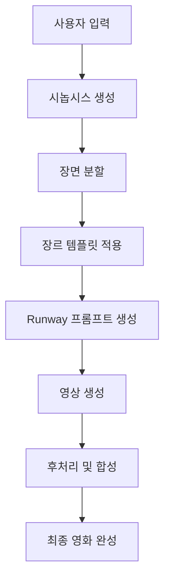

# 🎬 AI 단편영화 자동 생성기

> **장르 + 키워드 + 대사** 만 입력하면 AI가 자동으로 **5분 단편영화**를 생성해드립니다!


## ✨ 주요 기능

- 🎭 **4가지 장르 지원**: 스릴러, 로맨스, 공포, 코미디
- 🤖 **GPT-4 시나리오 생성**: 키워드와 대사를 바탕으로 완전한 시놉시스 자동 생성
- 🎬 **Runway ML 영상 생성**: 각 장면을 실제 영상으로 변환
- 📱 **반응형 웹 인터페이스**: 모던하고 직관적인 사용자 경험
- ⚡ **실시간 진행 상황**: 생성 과정을 단계별로 실시간 모니터링

## 🏗️ 시스템 아키텍처

```
┌─────────────────┐    ┌─────────────────┐    ┌─────────────────┐
│   Frontend      │    │   Backend       │    │   AI Services   │
│   (React)       │◄──►│   (FastAPI)     │◄──►│   GPT-4 +       │
│                 │    │                 │    │   Runway ML     │
└─────────────────┘    └─────────────────┘    └─────────────────┘
```

### 📁 프로젝트 구조

```
AI Movie/
├── 📄 api_server.py              # FastAPI 백엔드 서버
├── 📄 enhanced_gpt_parser.py     # GPT-4 시나리오 생성
├── 📄 runway_integration.py     # Runway ML 영상 생성
├── 📄 main_app.py               # CLI 앱
├── 📄 requirements.txt          # Python 의존성
├── 📄 render.yaml              # Render 배포 설정
├── 📄 env.example              # 환경변수 템플릿
├── 📂 frontend (React, Vite or Next.js)/
│   ├── 📄 package.json
│   ├── 📄 vite.config.ts
│   ├── 📄 tailwind.config.js
│   ├── 📄 index.html
│   └── 📂 src/
│       ├── 📄 App.tsx
│       ├── 📄 main.tsx
│       ├── 📄 App.css
│       └── 📂 components/
│           ├── 📄 MovieGeneratorForm.tsx
│           ├── 📄 ProgressTracker.tsx
│           └── 📄 ResultsDisplay.tsx
├── 📂 shared/
│   └── 📄 genre_templates.json
└── 📄 README.md
```

## 🚀 빠른 시작

### 1️⃣ 환경 설정

```bash
# 저장소 클론
git clone <repository-url>
cd "AI Movie"

# Python 의존성 설치 (루트 디렉토리에서)
pip install -r requirements.txt

# Node.js 의존성 설치
cd "frontend (React, Vite or Next.js)"
npm install
```

### 2️⃣ 환경 변수 설정

루트 디렉토리에 `.env` 파일을 생성하고 API 키를 설정하세요:

```env
# OpenAI API 키 (필수)
OPENAI_API_KEY=your_openai_api_key_here

# Runway ML API 키 (선택사항, Mock 모드로도 테스트 가능)
RUNWAY_API_KEY=your_runway_api_key_here
```

### 3️⃣ 서버 실행

**백엔드 서버 시작:**
```bash
# 루트 디렉토리에서
python api_server.py
```
- 🌐 API 서버: http://localhost:8000
- 📚 API 문서: http://localhost:8000/docs

**프론트엔드 서버 시작:**
```bash
cd "frontend (React, Vite or Next.js)"
npm run dev
```
- 🎨 웹 앱: http://localhost:3000

## 🎯 사용 방법

### 웹 인터페이스 사용

1. **장르 선택**: 스릴러, 로맨스, 공포, 코미디 중 선택
2. **키워드 입력**: 영화에 포함될 핵심 요소들 (예: "CCTV, 추적, 비밀")
3. **대사 입력**: 영화에 포함될 중요한 대사 (예: "누군가 우리를 지켜보고 있어")
4. **생성 시작**: "🎬 영화 생성하기" 버튼 클릭
5. **결과 확인**: 실시간으로 진행 상황을 확인하고 완성된 영상 다운로드

### 명령행 인터페이스 사용

```bash
# 루트 디렉토리에서
python main_app.py thriller "CCTV,추적,비밀" "누군가 우리를 지켜보고 있어"
```

## 🎭 지원 장르 및 템플릿

### 🔍 스릴러
- **특징**: 긴장감과 서스펜스
- **시각 스타일**: 어두운 색조, 로우키 조명, 핸드헬드 카메라
- **전형적 장면**: 오프닝 → 추격 → 진실 폭로 → 클라이맥스

### 💕 로맨스
- **특징**: 사랑과 감정
- **시각 스타일**: 따뜻한 색조, 소프트 조명, 부드러운 카메라 움직임
- **전형적 장면**: 첫 만남 → 관계 발전 → 갈등 → 해결

### 👻 공포
- **특징**: 공포와 두려움
- **시각 스타일**: 검은색/빨간색 색조, 극적인 조명, 흔들리는 카메라
- **전형적 장면**: 일상 → 첫 공포 → 상황 악화 → 최종 공포

### 😄 코미디
- **특징**: 유머와 웃음
- **시각 스타일**: 밝은 색조, 안정적인 카메라, 리액션 샷
- **전형적 장면**: 상황 설정 → 웃긴 상황 → 상황 악화 → 해피엔딩

## 🔧 API 엔드포인트

### POST `/generate-movie`
영화 생성 요청

```json
{
  "genre": "thriller",
  "keywords": "CCTV, 추적, 비밀",
  "dialogue": "누군가 우리를 지켜보고 있어"
}
```

### GET `/task-status/{task_id}`
생성 진행 상황 조회

```json
{
  "task_id": "uuid",
  "status": "running",
  "progress": 75,
  "current_task": "영상 생성 중...",
  "result": null
}
```

## 🛠️ 기술 스택

### Frontend
- **React 18** + **TypeScript**
- **Vite** (빌드 도구)
- **Tailwind CSS** (스타일링)
- **Lucide React** (아이콘)

### Backend
- **FastAPI** (웹 프레임워크)
- **Python 3.8+**
- **OpenAI GPT-4** (시나리오 생성)
- **Runway ML** (영상 생성)
- **Uvicorn** (ASGI 서버)

### AI Services
- **GPT-4**: 시놉시스 및 장면 생성
- **Runway ML**: 텍스트-투-비디오 변환

## 📊 생성 프로세스



## 🎬 테스트 예시

### 스릴러 영화 생성 테스트
```json
{
  "genre": "thriller",
  "keywords": "CCTV, 감시, 경비원",
  "dialogue": "당신을 계속 지켜보고 있었어요"
}
```

**생성 결과:**
- **시놉시스**: 한 경비원이 CCTV를 통해 여성을 감시하다가 직접 만나는 스릴러
- **장면 수**: 5개 장면
- **총 길이**: 300초 (5분)
- **저장 위치**: `generated_movies/thriller_CCTV감시경비원_YYYYMMDD_HHMMSS.json`

## 🚀 배포

### Render 배포
자세한 배포 가이드는 `backend (Node.js + Python)/RENDER_DEPLOY.md`를 참조하세요.

```bash
# 1. GitHub에 코드 업로드
git add .
git commit -m "Deploy ready"
git push origin main

# 2. Render에서 웹 서비스 생성
# 3. 환경변수 설정
# 4. 자동 배포 실행
```

### 환경변수 설정 (Render)
```
OPENAI_API_KEY=your_openai_api_key_here
RUNWAY_API_KEY=your_runway_api_key_here
PORT=10000
PYTHON_VERSION=3.11.0
```

## 🐛 문제해결

### 자주 발생하는 문제

1. **API 키 오류**
   ```
   해결: .env 파일에 올바른 API 키 설정
   ```

2. **모듈 import 오류**
   ```bash
   pip install -r requirements.txt
   ```

3. **포트 충돌**
   ```bash
   # 다른 포트 사용
   uvicorn api_server:app --port 8001
   ```

### Mock 모드 테스트
API 키가 없어도 Mock 모드로 전체 플로우를 테스트할 수 있습니다:
```bash
# .env 파일 없이 실행
python api_server.py
```

## 📝 라이센스

MIT License - 자유롭게 사용, 수정, 배포 가능합니다.

## 🤝 기여

1. Fork the repository
2. Create a feature branch
3. Commit your changes
4. Push to the branch
5. Create a Pull Request

## 📞 문의

프로젝트에 대한 문의사항이나 버그 리포트는 GitHub Issues를 이용해주세요.

---

**🎬 AI가 만드는 당신만의 단편영화를 지금 바로 경험해보세요!**
